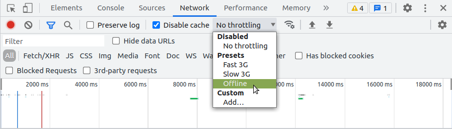
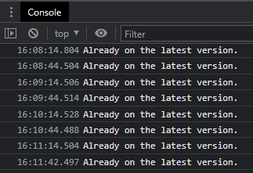
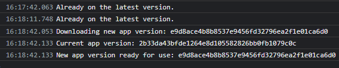
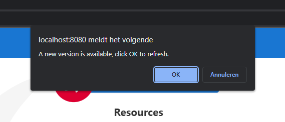

# AngularSwupdate

This project was generated with [Angular CLI](https://github.com/angular/angular-cli).

## Getting started

Run `npm install` to install all dependencies.

## Development server

Run `npm run start` for a dev server. Navigate to `http://localhost:4200/`. The
application will automatically reload if you change any of the source files. 

**Note:** Service workers are disabled for the dev server.

## Build

Run `npm run build` to build the project. The build artifacts will be stored in
the `dist/` directory.

## HTTP Server

Run `npm run http-server` to start a simple http server. Navigate to
`http://localhost:8080/`. You can 

## Testing the service worker

**Tip:** When testing Angular service workers, it's a good idea to use an
incognito or private window in your browser to ensure the service worker doesn't
end up reading from a previous leftover state, which can cause unexpected
behavior.

Source: https://angular.io/guide/service-worker-getting-started#service-worker-in-action-a-tour

### Test offline capabilities

1. Select Tools > Developer Tools (from the Chrome menu located in the top right
   corner).
2. Go to the Network tab.
3. Select Offline in the Throttling dropdown menu.



Now the application has no access to network interaction.

Source: https://angular.io/guide/service-worker-getting-started

### Test new version confirm

Run `npm run http-server` to start the http server. Navigate to
`http://localhost:8080/` in an incognito or private window.

Every 30 seconds the `CheckForUpdateService` checks if a new version is
available. This activity can be seen in the console.



To create a new build, first make a change that will be visible in the UI.

```ts
// src/app/app.component.ts
export class AppComponent {
  title = "angular-swupdate!!"; // Change the title
}
```

Run `npm run build` **while** the http server is running. Within 30 seconds the
service worker should pick up the new version and the `PromptUpdateService` will
display a `confirm` to trigger a refresh of the page.

The console will show there's a new version:



A popup will ask for a refresh:



After refreshing, the changed title should be visible:


## `installMode`

The installMode determines how these resources are initially cached. The
installMode can be either of two values:

- `prefetch` – Tells the Angular service worker to fetch every single listed resource
while it's caching the current version of the application. This is
bandwidth-intensive but ensures resources are available whenever they're
requested, even if the browser is currently offline.
- `lazy` – Does not cache any of the resources up front. Instead, the Angular service
worker only caches resources for which it receives requests. This is an
on-demand caching mode. Resources that are never requested are not cached. This
is useful for things like images at different resolutions, so the service worker
only caches the correct assets for the particular screen and orientation.

Source: https://angular.io/guide/service-worker-config#installmode

## More information

- [Service worker communication](https://angular.io/guide/service-worker-communications)
- [Service worker in production](https://angular.io/guide/service-worker-devops)
- [installMode: Determines how resources are initially cached](https://angular.io/guide/service-worker-config#installmode)
- [API > @angular/service-worker > SwUpdate](https://angular.io/api/service-worker/SwUpdate)
- [StackOverflow answer on how to implement SwUpdate](https://stackoverflow.com/a/50969084)
